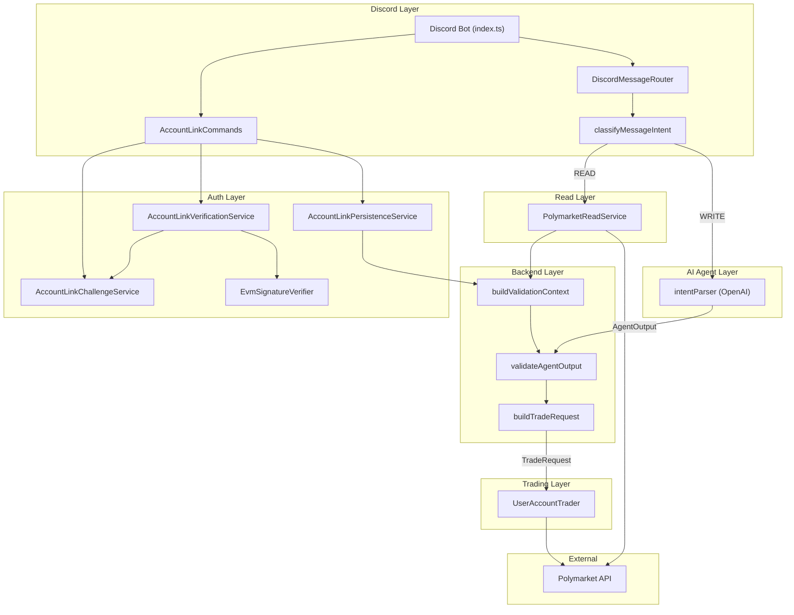

# Discord Polymarket Bot — Architecture

## High-Level Overview

Polybot lets Discord users **query live Polymarket markets** (READ pipeline) and **place trades through their own linked Polymarket account** (WRITE pipeline).
Account ownership is proven by an EIP-191 challenge-response flow before any trade can execute.

AI is used **only** for natural-language intent parsing.
All execution, validation, and security logic is handled by deterministic, auditable TypeScript code.

## Architecture Diagram



## Source Layout

```
src/
├── index.ts                          # Discord client & top-level routing
├── types.ts                          # Branded types, contracts, Trader interface
├── wire.ts                           # DI wiring (in-memory stubs today)
│
├── agent/
│   └── intentParser.ts               # OpenAI structured-output intent parser
│
├── auth/
│   ├── AccountLinkChallengeService.ts # Challenge lifecycle (issue / validate / consume)
│   ├── AccountLinkVerificationService.ts # Signature verification orchestration
│   ├── AccountLinkPersistenceService.ts  # Discord↔Polymarket link persistence
│   ├── EvmSignatureVerifier.ts        # EIP-191 personal_sign via ethers
│   └── polymarketAuth.ts             # (Reserved for future OAuth flows)
│
├── backend/
│   ├── validateAgentOutput.ts         # Pure deterministic precondition validator
│   ├── buildValidationContext.ts      # Constructs ValidationContext from services
│   └── buildTradeRequest.ts           # Pure structural assembler → TradeRequest
│
├── discord/
│   ├── classifyMessageIntent.ts       # READ / WRITE classifier (regex, no AI)
│   ├── DiscordMessageRouter.ts        # Orchestration + user-facing message boundary
│   └── AccountLinkCommands.ts         # connect / verify / disconnect command handlers
│
├── read/
│   └── PolymarketReadService.ts       # Read-only market data layer
│
├── trading/
│   ├── UserAccountTrader.ts           # Execution-only Trader for linked accounts
│   └── houseTrader.ts                 # (Legacy demo house-wallet Trader)
│
└── storage/
    └── limits.ts                      # (Placeholder for persistent limit tracking)
```

## Layer Responsibilities

| Layer | Responsibility | What it must **not** do |
|-------|---------------|------------------------|
| **Discord** | Message routing, user-facing presentation, command parsing | Execute trades, perform crypto, own business rules |
| **AI Agent** | Parse natural language → structured `AgentOutput` JSON | Execute anything, decide limits, access wallets |
| **Backend** | Deterministic validation, limit checks, request assembly | Format user-facing text, call Polymarket directly |
| **Auth** | Challenge lifecycle, EIP-191 signature verification, link persistence | Discord transport, trade execution |
| **Read** | Market data queries (list, search, summarize) | Mutate state, execute trades |
| **Trading** | Execute validated `TradeRequest` via Polymarket gateway | Parse intents, validate limits, format messages |

## Key Design Principles

1. **Result unions over exceptions** — Every service returns `{ ok: true; ... } | { ok: false; errorCode: ... }`. User-facing formatting happens only in the Discord layer.
2. **Branded primitives** — `DiscordUserId`, `PolymarketAccountId`, `MarketId`, `UsdCents` prevent accidental mixing of string/number types.
3. **Injected context** — Validators and assemblers receive all inputs as data. No I/O inside pure functions.
4. **Conservative classification** — The READ/WRITE classifier defaults to READ on ambiguity. WRITE requires both an explicit trade verb and a monetary reference.
5. **Challenge-response linking** — Account ownership is proven via EIP-191 `personal_sign` with a `crypto.randomUUID()` nonce, 5-minute TTL, and one-time consumption enforced after signature verification passes.

## Data Flows

### Account Linking (connect → verify → disconnect)

1. User sends `connect account` in Discord.
2. `AccountLinkChallengeService` issues a challenge with a cryptographic nonce (5-min TTL).
3. Bot replies with the nonce and the exact message to sign.
4. User signs the message in their wallet and sends `verify <accountId> <nonce> <signature>`.
5. `AccountLinkVerificationService` validates the challenge (without consuming), verifies the EIP-191 signature, then consumes the challenge.
6. `AccountLinkPersistenceService` stores the Discord↔Polymarket link (overwrite semantics: one account per user).
7. User sends `disconnect` → link is removed.

### Placing a Trade (WRITE pipeline)

1. User sends a natural-language message in Discord.
2. `classifyMessageIntent` routes to WRITE (trade verb + money reference detected).
3. `intentParser` (OpenAI) extracts structured `AgentOutput` with intent `place_bet`.
4. `buildValidationContext` resolves linked account + live markets + spend limits into a `ValidationContext`.
5. `validateAgentOutput` runs deterministic precondition checks (account linked, market active, amount valid, limits OK).
6. `buildTradeRequest` assembles a `TradeRequest` with a deterministic idempotency key (5-min time buckets).
7. `UserAccountTrader` executes the trade through the Polymarket gateway.
8. Result (success or error code) is mapped to a user-facing string in `DiscordMessageRouter`.

### Querying Markets (READ pipeline)

1. User sends a question or informational message.
2. `classifyMessageIntent` routes to READ (default for ambiguous messages).
3. `PolymarketReadService` fetches live markets, searches by text, and summarizes.
4. Read explainer formats a human-readable response.

## Failure Handling & Safety

- **Idempotency** — Trade requests carry a deterministic idempotency key derived from (identity + market + outcome + amount + time bucket).
- **Result unions** — No exceptions cross service boundaries; every failure is a typed error code.
- **Challenge replay prevention** — Challenges are one-time-use (consumed only after signature verification), TTL-bounded, and use `crypto.randomUUID()` nonces.
- **Conservative defaults** — Unknown intents route to READ. Validation rejects before execution.
- **No secrets in Discord/AI layers** — Private keys and wallet credentials never enter the Discord or AI layers.

## Current Stub Boundaries (pre-production)

The following components are wired with **in-memory stubs** in `wire.ts`:

| Stub | Production replacement needed |
|------|-------------------------------|
| `InMemoryAccountLinkChallengeStore` | Persistent store (Redis / database) with TTL enforcement |
| `InMemoryAccountLinkStore` | Database-backed persistence |
| `InMemoryPolymarketReadProvider` | Live Polymarket CLOB API integration |
| `StubPolymarketExecutionGateway` | Live Polymarket order execution API |
| `DAILY_LIMIT_CENTS_STUB` / `SPENT_THIS_HOUR_CENTS_STUB` | Real per-user spend tracking service |
